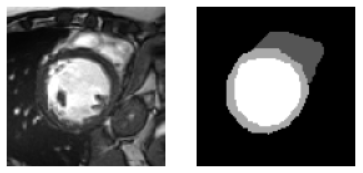
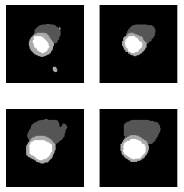

# Cardiac MR Image Segmentation using PyTorch

## Description

Cardiac image segmentation using Python & PyTorch. The goal of segmentation is to divide an image
into distinct regions.

## Results

Dice similarity scores of 82% - 92% were achieved with the hybrid architecture, which was custom
designed and inspired by a variety of segmentational neural network architectures.

Segmentation results were uploaded to Kaggle to verify the performance on unseen data. The hybrid
architecture was later refined, and a U-Net implementation proved to be more consistent achieving
overall accuracy of 90%-95%.
